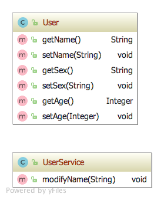

### 单一职责原则（SRP：Single responsibility principle）
> 单一职责原则（SRP：Single responsibility principle）又称单一功能原则，面向对象五个基本原则（SOLID）之一。它规定一个类应该只有一个发生变化的原因。该原则由罗伯特·C·马丁（Robert C. Martin）于《敏捷软件开发：原则、模式和实践》一书中给出的。马丁表示此原则是基于汤姆·狄马克(Tom DeMarco)和Meilir Page-Jones的著作中的内聚性原则发展出的。

**定义：** 就一个类而言，应该仅有一个引起它变化的原因。


> 其实我们在日常开发中，很多时候不知不觉中就在遵循着这个原则


#### 1. 使用场景

``````java
/**
 * @author ：apple
 * @description ：
 * @copyright ：	Copyright 2018 yowits Corporation. All rights reserved.
 * @create ：2018/12/15 下午4:14
 */
public class User {
    
    private String name;
    private String sex;
    private Integer age;

    /**
     * 这个方法有问题
     * @param name
     */
    public void modifyName(String name){
        //修改名字
        System.out.println("修改名字： "+ name);
    }

}
``````
我们可能已经看出来了，这个User.java 只是我们的实体类，而我们让他担任了修改名字的职责和设置属性的职责。

修改名字这个方法我们应该是放在我们UserService.java中，他属于业务代码，我们不知不觉中就在遵守着这个原则

下面看下修改后的UML图




